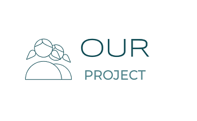

# Запити зацікавлених осіб

## Вступ

Цей документ містить запити зацікавлених осіб, що стосуються нашого проекту. Тут будуть визначені головні критерії, що стосуються функцій, практичності, надійності, продуктивності та зручності використання продукту. Крім того, будуть наведені короткі описи можливих варіантів використання даного програмного забезпечення.

### Мета

Метою документа є визначення основних вимог до продуктивності, функціональності та експлуатаційної придатності проекту, а також визначення бізнес-правил, технологічних обмежень, процесів та факторів, які впливають на предмет розробки.А також, розробка зручної системи управління проєктами, яка дозволить користувачам керувати проектами більш ефективно.

### Контекст

У даному документі будуть визначені вимоги та необхідний функціонал для проекту з назвою "Система управління проектами" - нашого проекту.

### Основні визначення та скорочення

**Зацікавлені особи** — бізнес-актори, дослідники, викладачі, учасники соціальних опитувань.

**Ділові процеси** — це набір бізнес-завдань і дій, виконання яких людьми або системами в структурованому порядку дає результат, який сприяє досягненню бізнес-цілей.

**FURPS** — це акронім, що представляє модель для класифікації атрибутів якості програмного забезпечення:

  * Functionality — функціональні вимоги: властивості, можливості, безпека. Є основними, за цими вимогами будуються діаграми варіантів використання.  
  * Usability — вимоги до зручності використання: людський фактор, естетика, послідовність, документація.  
  * Reliability — вимоги до надійності: частота можливих збоїв, стійкість до відмов, відновлюваність, передбачуваність стійкості.  
  * Performance — вимоги до продуктивності: час відгуку, використання ресурсів, ефективність, потужність, масштабованість.  
  * Supportability — вимоги до підтримки: можливість підтримки, ремонтопридатність, гнучкість, модифікованість, модульність, розширюваність, можливість локалізації.

*Інші визначення див. в документі [аналіз предметної області](state-of-the-art.md#основні-визначення)*

### Посилання

[Зацікавлені особи](https://uk.wikipedia.org/wiki/%D0%97%D0%B0%D1%86%D1%96%D0%BA%D0%B0%D0%B2%D0%BB%D0%B5%D0%BD%D1%96_%D1%81%D1%82%D0%BE%D1%80%D0%BE%D0%BD%D0%B8)  
[Ділові процеси](https://stud.com.ua/51643/menedzhment/dilovi_komunikatsiyi_biznes_protses_uzagalnena_model_protsesu_dilovoyi_komunikatsiyi)  
[FURPS](https://ru.wikipedia.org/wiki/FURPS)

*Інші посилання див. в документі [аналіз предметної області](state-of-the-art.md#осилання)*

## Короткий зміст

Короткий огляд всього документу:

 - [Характеристика ділових процесів](#характеристика-ділових-процесів)
 - [Короткий огляд продукту](#короткий-огляд-продукту)
 - [Функціональність](#функціональність)
 - [Практичність](#практичність)
 - [Надійність](#надійність)  
 - [Продуктивність](#продуктивність)  
 - [Експлуатаційна придатність](#експлуатаційна-придатність)  

## Характеристика ділових процесів

В цьому розділі визначаються зовнішні фактори, що впливають на бізнес (бізнес-актори), 
та внутрішні фактори (робітники). Також, дається загальна характеристика діяльності бізнес-акторів 
та робітників, яка здійснюється за допомогою бізнесу.

**Учасники проекту** - це люди або організації, які залучені до виконання проекту, а також ті, хто залежить або зацікавлений у результатах проекту, його успішному виконанні. Учасники проекту реалізують різні інтереси у процесі здійснення проекту, формують власні вимоги відповідно до цілей та мотивації і впливають на проект, виходячи зі своїх інтересів, компетенцій та ступеню залучення до проекту.

Розрізняють таких **учасників проекту**:

**1.** Менеджер (керівник) проекту (Project Manager) — особа, відповідальна за управління проектом.  
**2.** Замовник (Project Customer) — особа (організація), яка приймає результати роботи і платить за її виконання.  
**3.** Користувач продукту проекту (User) — особа усередині або поза організацією, яке використовуватиме результати проекту.  
**4.** Виконуюча організація (Performing organization) — організація, співробітники якої безпосередньо залучені у виконання проектних робіт.  
**5.** Члени проектної команди (Project team members) — група, що виконує роботу за проектом.  
**6.** Впливові особи (Influencers) — особи або групи осіб, які прямо не будуть розпоряджатися або використовувати результати проекту, але через своє положення в організації можуть вплинути, позитивно або негативно, на просування проекту.

*Зовнішніми факторами* (бізнес-акторами) системи є:

- Користувач продукту проекту (User)  
- Замовник (Project Customer)  

*Внутрішніми факторами* (бізнес-робітниками) системи є:

- Менеджер (керівник) проекту (Project Manager)  
- Виконуюча організація (Performing organization)  
- Члени проектної команди (Project team members)  
- Впливові особи (Influencers)

Опис бізнес-сценаріїв взаємодії бізнес-акторів, робітників та інформаційної системи за допомогою наступної **специфікації**:

|ID| USER.REGISTRATION|
|:--|:--|
|Назва:|Реєстрація користувача|
|Учасники:|Користувач, система|
|Передумови:|Обліковий запис користувача не створений у системі|
|Результат:|Користувач зареєстрований в системі|
|Виключні ситуації:| _USER.ERRORS.ALREADY_EXISTS_ - Користувач вже зареєстрований в системі _USER.ERR.INVORSALID_DATA_ - Користувач ввів некоректні дані|
|Основний сценарій:|1. Користувач вводить свої логін та пароль 2. Система перевіряє коректність введених даних 3. Система реєструє користувача 4. Успішна реєстрація|

|ID| USER.LOGIN|
|:--|:--|
|Назва:|Вхід користувача|
|Учасники:|Користувач, система|
|Передумови:|Користувач ввів логін та пароль Користувач зареєстрований в системі|
|Результат:|Користувач отримав доступ до функціоналу системи згідно своєї ролі|
|Виключні ситуації:|_USER.ERRORS.NOT_EXIST_ - Користувач не зареєстрований в системі _USER.ERRORS.INVALID_CREDENTIALS_ - Користувач ввів невірний логін або пароль|
|Основний сценарій:|1. Користувач вводить свої логін та пароль 2. Система перевіряє коректність введених даних 3. Система авторизує користувача в систему 4. Користувач отримує повідомлення про успішну авторизацію|
   
|ID| PROJECT.CREATE|
|:--|:--|
|Назва:|Створення проекту|
|Учасники:|Користувач (Менеджер/Адміністратор), система|
|Передумови:|Користувач має необхідні права доступу до функціоналу системи|
|Результат:|Проект створено|
|Виключні ситуації:|_PROJECT.ERRORS.ACCESS_DENIED_ - Користувач не має необхідних прав доступу до функціоналу системи _PROJECT.ERRORS.INVALID_DATA_ - Користувач ввів некоректні дані|
|Основний сценарій:|1. Користувач вводить назву проекту та опис 2. Система перевіряє коректність введених даних 3. Система створює проект 4. Користувач отримує повідомлення про успішне створення проекту|

|ID| PROJECT.EDIT|
|:--|:--|
|Назва:|Редагування проекту|
|Учасники:|Користувач (Менеджер/Адміністратор), система|
|Передумови:|Користувач має необхідні права доступу до функціоналу системи|
|Результат:|Проект відредаговано|
|Виключні ситуації:|_PROJECT.ERRORS.ACCESS_DENIED_ - Користувач не має необхідних прав доступу до функціоналу системи _PROJECT.ERRORS.INVALID_DATA_ - Користувач ввів некоректні дані _PROJECT.ERRORS. NOT_EXIST_- Проекту не існує|
|Основний сценарій:|1. Користувач вводить назву проекту та опис 2. Система перевіряє коректність введених даних 3. Система відредаговує проект 4. Користувач отримує повідомлення про успішне відредагування проекту|

|ID| PROJECT.DELETE|
|:--|:--|
|Назва:|Видалення проекту|
|Учасники:|Користувач (Менеджер/Адміністратор), система|
|Передумови:|Користувач має необхідні права доступу до функціоналу системи|
|Результат:|Проект видалено|
|Виключні ситуації:|_PROJECT.ERRORS.ACCESS_DENIED_ - Користувач не має необхідних прав доступу до функціоналу системи _PROJECT.ERRORS.INVALID_DATA_ - Користувач ввів некоректні дані _PROJECT.ERRORS.NOT_EXIST_ - Проекту не існує|
|Основний сценарій:|1. Користувач натискає на "Видалити проект" 2. Система перевіряє коректність введених даних 3. Система видаляє проект 4. Користувач отримує повідомлення про успішне видалення проекту|

|ID| PROJECT.ADD_MEMBER|
|:--|:--|
|Назва:|Додавання учасника до проекту|
|Учасники:|Користувач (Менеджер/Адміністратор), система|
|Передумови:|Користувач має необхідні права доступу до функціоналу системи|
|Результат:|Учасник доданий до проекту|
|Виключні ситуації:|_PROJECT.ERRORS.ACCESS_DENIED_ - Користувач не має необхідних прав доступу до функціоналу системи _PROJECT.ERRORS.INVALID_DATA_ - Користувач ввів некоректні дані _PROJECT.ERRORS.NOT_EXIST_ - Проекту не існує _PROJECT.ERRORS.USER_NOT_EXIST_ - Користувача не існує|
|Основний сценарій:|1. Користувач вводить username або id учасника 2. Система перевіряє коректність введених даних 3. Система додає учасника до проекту 4. Користувач отримує повідомлення про успішне додавання учасника до проекту|

|ID| TASK.CREATE|
|:--|:--|
|Назва:|Створення завдання|
|Учасники:|Користувач (Менеджер/Адміністратор), система|
|Передумови:|Користувач має необхідні права доступу до функціоналу системи|
|Результат:|Завдання створено|
|Виключні ситуації:|_TASK.ERRORS.ACCESS_DENIED_ - Користувач не має необхідних прав доступу до функціоналу системи _TASK.ERRORS.INVALID_DATA_ - Користувач ввів некоректні дані|
|Основний сценарій:|1. Користувач вводить назву завдання та опис 2. Система перевіряє коректність введених даних 3. Система створює завдання 4. Користувач отримує повідомлення про успішне створення завдання|

|ID| TASK.EDIT|
|:--|:--|
|Назва:|Редагування завдання|
|Учасники:|Користувач (Менеджер/Адміністратор), система|
|Передумови:|Користувач має необхідні права доступу до функціоналу системи|
|Результат:|Завдання відредаговано|
|Виключні ситуації:|_TASK.ERRORS.ACCESS_DENIED_ - Користувач не має необхідних прав доступу до функціоналу системи _TASK.ERRORS.INVALID_DATA_ - Користувач ввів некоректні дані _TASK.ERRORS.NOT_EXIST_ -Задачі не існує|
|Основний сценарій:|1. Користувач вводить назву завдання та опис 2. Система перевіряє коректність введених даних 3. Система відредаговує завдання 4. Користувач отримує повідомлення про успішне відредагування завдання|

|ID| TASK.CHANGE_STATUS|
|:--|:--|
|Назва:|Зміна статусу завдання|
|Учасники:|Користувач, система|
|Передумови:|Задача існує|
|Результат:|Статус завдання змінено|
|Виключні ситуації:|_TASK.ERRORS.INVALID_DATA_ - Користувач ввів некоректні дані _TASK.ERRORS.NOT_EXIST_ - Задачі не існує|
|Основний сценарій:|1. Користувач змінює статус завдання 2. Система перевіряє коректність введених даних 3. Система змінює статус завдання 4. Користувач отримує повідомлення про успішне змінення статусу|

|ID| TASK.REMOVE|
|:--|:--|
|Назва:|Видалення завдання|
|Учасники:|Користувач, система|
|Передумови:|Задача існує|
|Результат:|Задачу видалено|
|Виключні ситуації:|_TASK.ERRORS.INVALID_DATA_ - Користувач ввів некоректні дані _TASK.ERRORS.NOT_EXIST_ - Задачі не існує|
|Основний сценарій:| 1. Користувач натискає відповідну кнопку 2. Система перевіряє коректність введених даних 3. Система видаляє задачу 4. Користувач отримує повідомлення про видалення задачі|

## Короткий огляд продукту

Система управління проєктами - це програмне забезпечення, метою якого є підвищення ефективності та автоматизація життєвого циклу проєкту для забезпечення більшої продуктивності бізнесу. що включає в себе планування завдань, контроль цін та бюджета, розподіл ресурсів, співпрацю, комунікацію, управління документами та системами та інші програми, які спільно використовуються для управління великими проектами

"Our project" — це система управління проектами, яка полегшує процес їх розроблення і допомогає створювати як великі, так і малі за розміром проекти з використанням доступних в ній функцій. 

## Функціональність

Functionality (функциональні вимоги)

Для того, щоб впорядкувати взаємодію між різними ролями користувачів системи та автоматизувати поділ на ці ролі, система повинна мати відповідні режими, кожен з яких буде реалізований через відповідний йому інтерфейс.

<u>Менеджер/Адміністратор/Teamlead:</u>

◆ Створити/Видалити проект  
◆ Додати/Видалити учасника з проекту  
◆ Створити/Видалити/Змінити завдання  
◆ Змінити статус завдання    
◆ Призначення виконавця завдання  
◆ Прийняти кандидатуру на виконавця завдання  

<u>Розробник:</u>

◆ Прийняти завдання  
◆ Видвинути свою кандидатуру на виконавця завдання  
◆ Запросити заміну виконавця завдання  
◆ Змінити статус завдання  

## Практичність

Usability (вимоги до зручності роботи)

◇ Тривіальність використання  
◇ Кросплатформенність  
◇ Можливість встановити виконавців   
◇ Можливість встановити дедлайн на завдання      
◇ Наявність функції "Forgot your password?"

## Надійність

Reliability (вимоги до надійності)

◈ Можливість зміни паролю  
◈ Можливість включити додатковий захист акаунту  
◈ Захист даних користувача  
◈ Створення резервних копій  
◈ Володіти засобами захисту/шифровки даних користувачів та проєктів

## Продуктивність

Performance (вимоги до продуктивності)

◆ Швидкий обмін і оновлення даних    
◆ Підтримка великої кількісті задач в проєкті   
◆ Підтримка великої кількісті учасників в проєкті    
◆ Швидко приймати запити користувачів і віддавати дані без суттєвих затримок   
◆ Блокувати спроби спаму 

## Експлуатаційна придатність

Supportability (вимоги до підтримки)

◇ Швидке усунення неочікуваних збоїв системи  
◇ Постійне розроблення нового функціоналу (оновлення)  
◇ Оптимізація коду  
◇ Опрацювання та аналіз помилок  
